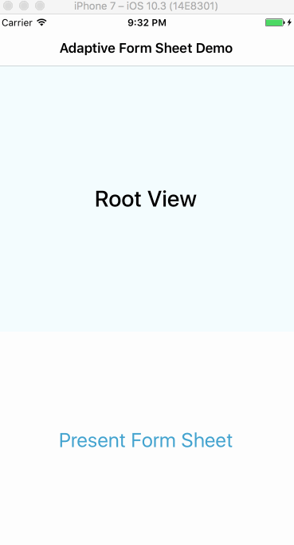
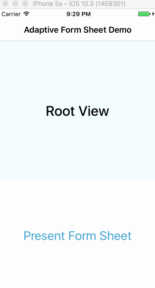

# AdaptiveFormSheet
A Modal Presentation Controller that adapts to content size, keyboard visibility, and touch input.

## Features
 - Presents your modal over current context, dimming the presenting view controller
 - Keeps your modal centered in the available space
 - Automatically responds to keyboard events
 - Ensures the current First Responder is always visible
 
      

## Installation
You can use `AdaptiveFormSheet` in your own projects through [Carthage](https://github.com/Carthage/Carthage).

Add `github "calda/AdaptiveFormSheet"` to your Cartfile and run `carthage update`.

## Usage

If your View Controller subclasses `AFSModalViewController`, presentations from segues or through `UIViewController.present(_:animated:completion:)` will automatically adopt this presentation style:

```swift
import AdaptiveFormSheet

class MyModelViewController: AFSModalViewController {
   ...
}
```

`AdaptiveFormSheet` uses `preferredContentSize` to decide how large to make your modal. It may be able to infer this automatically, but you can also override the property in your subclass to define it explicitly:

```swift
override var preferredContentSize: CGSize {
    get { return CGSize(width: 300, height: 450) }
    set { }
}
```
